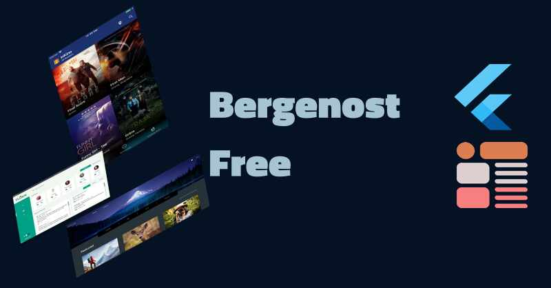
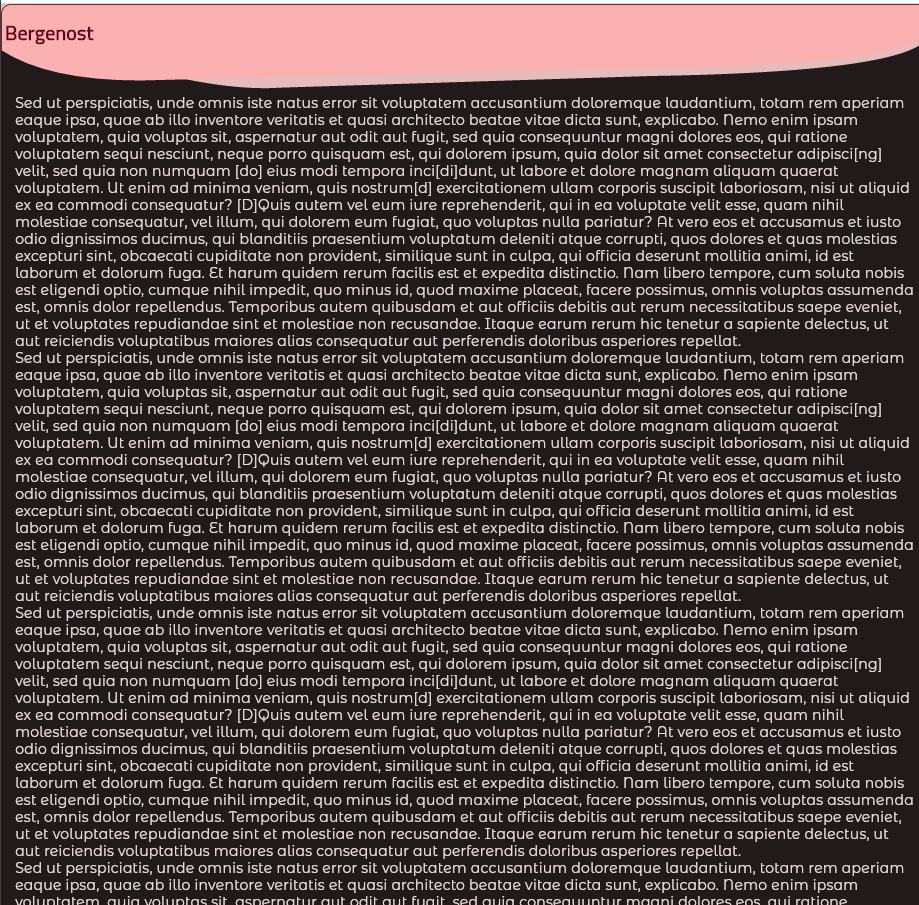

# Bergenost Free

Bergenost Free is a free UI component AppBar with shapes applied. The template is in the bergenost appbar two folder.

## Screenshots

## About Fred Grott 
I use KeyBase for my communications:

[KeyBase](https://keybase.io/fredgrott)

My articles can be found on Medium:
[medium](https://fredgrott.medium.com)

You can viewe my social posts on:

[Twitter](https://twitter.com/fredgrott)

[Dribbble](https://dribbble.com/FredGrott)

[DeviantArt](https://www.deviantart.com/shareme)

[BeHance](https://www.behance.net/gwsfredgrott)

## Useful Resources

GumRoad Products such as UI Kits, etc.
[GumRoad Products](https://app.gumroad.com/fredgrott)

MaterialUp Products such as UI Kits, etc.
[MaterialUp Products](https://www.uplabs.com/fred_grott)
